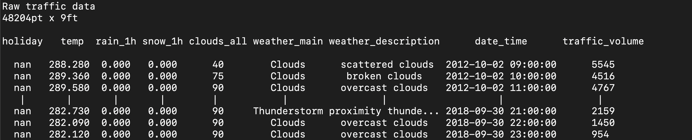
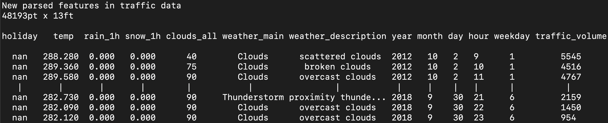
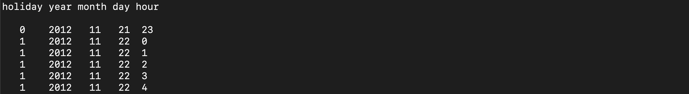

Cleaning Data
=============

Using nimble to prepare interstate traffic volume data
~~~~~~~~~~~~~~~~~~~~~~~~~~~~~~~~~~~~~~~~~~~~~~~~~~~~~~

Our goal is to prepare the ``'Metro_Interstate_Traffic_Volume.csv'``
dataset for machine learning. The algorithms we want to use require
numeric data and can be sensitive to outliers so we will need to perform
some preprocessing of this raw data before we can begin to employ
`Supervised Learning`_. Let's explore how we can clean this data in
nimble.

Getting started
---------------

.. code:: python

   from datetime import datetime

   import nimble

   traffic = nimble.data('Matrix', 'Metro_Interstate_Traffic_Volume.csv',
                         featureNames=True)
   # kwargs for use with .show to generate output desired for markdown files
   showKwargs = {'includeObjectName': False, 'maxHeight': 9, 'maxWidth': 120}
   traffic.show("Raw traffic data", **showKwargs)

|rawTraffic|

Our data contains 48,204 points and 9 features. The features are
variables which may affect the traffic volume on an interstate highway
and the current traffic volume. A ``featureReport`` can provide a good
starting point for cleaning the data.

.. code:: python

   print(traffic.featureReport())

|featureReport|

Statistics could not be calculated for four of our features, indicating
they are non-numeric. The other five features are numeric but there are
indications that some outlier values may be present. Nimble provides a
variety of functions and methods to help us address these issues.

Cleaning numeric data
---------------------

0 Kelvin in ``temp`` and 9831.3 mm in ``rain_1h`` indicate some outliers
exist in these features. Let's extract those values to decide how to
proceed.

.. code:: python

   def outlierIdentifier(pt):
       if pt['temp'] == 0 or pt['rain_1h'] == 9831.3:
           return True
       return False

   outliers = traffic.points.extract(outlierIdentifier)

   print(traffic[:, ['temp', 'rain_1h']].featureReport())
   print('Number of points with outliers:', len(outliers.points))

|outliers|

After extracting those values, our ``featureReport`` statistics look
much more reasonable for those features. We can assume the 11 extracted
points contain recording errors so we will ignore ``outliers`` and
continue with the 48,193 points still remaining in ``traffic``.

Cleaning non-numeric data
-------------------------

The values in the ``date_time`` feature are strings, but we can parse
each string to generate five new numeric features to replace this
feature.

.. code:: python

   def dateTimeSplit(value):
       dt = datetime.strptime(value, "%Y-%m-%d %H:%M:%S")
       return [dt.year, dt.month, dt.day, dt.hour, dt.weekday()]

   traffic.features.splitByParsing('date_time', dateTimeSplit,
                                   ['year', 'month', 'day', 'hour', 'weekday'])

   traffic.show('New parsed features in traffic data', **showKwargs)

|parsedDateTime|

The ``holiday`` feature contains a holiday name string for the first
point of each holiday, all other values are missing.

.. code:: python

   samplePts = slice(1369,1374)
   dateFts = ['holiday', 'year', 'month', 'day', 'hour']
   print(traffic[samplePts, dateFts])

|holiday|

We will transform the ``holiday`` feature to a numeric feature by
writing a function that assigns each point a new binary value in the
``holiday`` feature.

.. code:: python

   # TODO using 1/0 for now until True/False can be loaded from csv
   currentHoliday = {'date': None}
   def holidayToBinary(point):
       filledPt = []
       dateTuple = (point['year'], point['month'], point['day'])
       if isinstance(point['holiday'], str):
           currentHoliday['date'] = dateTuple
       if currentHoliday['date'] == dateTuple:
           filledPt.append(1)
       else:
           filledPt.append(0)
           currentHoliday['date'] = None

       filledPt.extend(point[1:])

       return filledPt

   traffic.points.transform(holidayToBinary)

   print(traffic[samplePts, dateFts])

|transformedHoliday|

The ``weather_main`` and ``weather_description`` features are very
similar.

.. code:: python

   weatherFts = ['weather_main', 'weather_description']
   print(traffic[samplePts, weatherFts])

|weather|

While ``weather_description`` is more detailed, many of its unique
values represent a very small proportion of the data. So, we will
utilize the more general ``weather_main`` and remove
``weather_description``. To make the string values in ``weather_main``
suitable for machine learning, we will represent each of the 11 unique
values as 11 new binary features.

.. code:: python

   traffic.features.delete('weather_description')
   newCols = traffic.replaceFeatureWithBinaryFeatures('weather_main')
   print(traffic[samplePts, newCols[:3]])

|binaryWeather|

Our dataset is now ready for machine learning.

.. code:: python

   traffic.show('Cleaned traffic data', **showKwargs)

|cleanedTraffic|

Writing to a file
-----------------

So that we can load the cleaned data for our supervised learning
example, we will write it to a new csv file.

.. code:: python

   traffic.writeFile('Metro_Interstate_Traffic_Volume_Cleaned.csv')

.. toctree::

  view source <python/traffic_clean>

* :download:`download source <python/traffic_clean.py>`

| **Link to dataset:**
| `https://archive.ics.uci.edu/ml/datasets/Metro+Interstate+Traffic+Volume`_

| **Reference:**
| Dua, D. and Graff, C. (2019). UCI Machine Learning Repository
  [http://archive.ics.uci.edu/ml]. Irvine, CA: University of California,
  School of Information and Computer Science.

.. _Supervised Learning: supervisedLearning.html
.. _`https://archive.ics.uci.edu/ml/datasets/Metro+Interstate+Traffic+Volume`: https://archive.ics.uci.edu/ml/datasets/Metro+Interstate+Traffic+Volume

.. |featureReport| image:: images/featureReport.png
.. |outliers| image:: images/outliers.png

.. |weather| image:: images/weather.png
.. |binaryWeather| image:: images/binaryWeather.png
.. |cleanedTraffic| image:: images/cleanedTraffic.png
