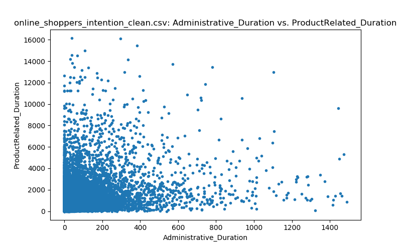
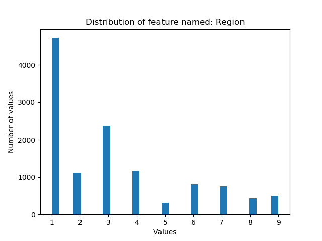
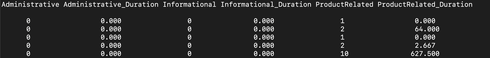

Exploring Data
==============

Using nimble to gain insight on the behaviors of online shoppers
~~~~~~~~~~~~~~~~~~~~~~~~~~~~~~~~~~~~~~~~~~~~~~~~~~~~~~~~~~~~~~~~

Our dataset, ``'online_shoppers_intention_clean.csv'``, is a collection
of behaviors for visitors to an online shopping website. Our goal is to
explore this dataset to gather information about the visitors to this
site using a variety of the function and methods nimble has available
for digging deeper into a dataset.

Getting Started
---------------

.. code:: python

   import nimble

   visits = nimble.data('DataFrame', 'online_shoppers_intention_clean.csv',
                        featureNames=True)

Data Overview
-------------

Each point in this dataset represents a single visit to an online
shopping website where 18 features are recorded.

.. code:: python

   featureNames = visits.features.getNames()

The first 6 features record the counts and durations of time spent on
the site, based on the types of pages the visitor viewed.

.. code:: python

   webActivityFts = featureNames[:6]
   print(visits[:4, webActivityFts].toString(maxWidth=120))

|activity|

The next 3 features are website analytics collected during the visit.

.. code:: python

   webAnalyticsFts = featureNames[6:9]
   print(visits[:4, webAnalyticsFts].toString(maxWidth=120))

|analytics|

The last 9 features are details on the visit or visitor.

.. code:: python

   visitDetailFts = featureNames[9:]
   print(visits[:4, visitDetailFts].toString(maxWidth=120))

|details|

Now that we have a better understanding of our data, let's see what we
can learn from it.

.. _exploring-data-through-data-object-methods:

Exploring data through data object methods.
-------------------------------------------

| Revenue is a boolean feature indicating if the visitor made a
  purchase.
| How does Revenue correlate with other features?

.. code:: python

   correlations = visits.features.similarities('correlation')
   print(correlations[:, 'Revenue'])

|correlations|

What proportion of visits generated revenue?

.. code:: python

   revenueGen = sum(visits.features['Revenue']) / len(visits.points)
   print('Proportion of visits that generated revenue:', revenueGen)

|revenue|

| The SpecialDay feature ranges from 0 to 1 indicating proximity to a
  special day (such as Mother's Day), where increased visits might be
  expected.
| What proportion of visits occur in proximity to a special day?

.. code:: python

   special = visits.points.count('SpecialDay>0') / len(visits.points)
   print('Proportion of visits near a special day:', special)

|specialDay|

Exploring data through nimble's calculate module
------------------------------------------------

| This site categorizes their pages into the three types in the list
  below.
| Which types of pages are being visited the most?

.. code:: python

   for ft in ['Administrative', 'Informational', 'ProductRelated']:
       mean = nimble.calculate.mean(visits[:, ft])
       print(ft, 'average hits per visit', mean)

|pageHits|

What proportion of visitors reach a product-related page?

.. code:: python

   noProduct = nimble.calculate.proportionZero(visits.features['ProductRelated'])
   print('Proportion of visitors that view a product page:', 1 - noProduct)

|product|

Exploring data through plotting
-------------------------------

Is there a relationship between time spent on administrative pages and
product related pages?

.. code:: python

   visits.plotFeatureAgainstFeature('Administrative_Duration',
                                    'ProductRelated_Duration')

|duration|

| Each visitor's location is classified into one of nine regions in the
  Region feature.
| How is site traffic distributed by region?

.. code:: python

   visits.plotFeatureDistribution('Region')

|regions|

We have learned a lot about website visitors on our own. Next see how
applying an `Unsupervised Learning`_ model can help us learn even more.

.. toctree::

  view source <scripts/shoppers_explore>

* :download:`download source <scripts/shoppers_explore.py>`

| **Link to original dataset:**
| `https://archive.ics.uci.edu/ml/datasets/Online+Shoppers+Purchasing+Intention+Dataset`_

| **References:**
| Sakar, C.O., Polat, S.O., Katircioglu, M. et al. Neural Comput &
  Applic (2018). [https://doi.org/10.1007/s00521-018-3523-0]

Dua, D. and Graff, C. (2019). UCI Machine Learning Repository
[http://archive.ics.uci.edu/ml]. Irvine, CA: University of California,
School of Information and Computer Science.

.. _Unsupervised Learning: unsupervisedLearning.html
.. _`https://archive.ics.uci.edu/ml/datasets/Online+Shoppers+Purchasing+Intention+Dataset`: https://archive.ics.uci.edu/ml/datasets/Online+Shoppers+Purchasing+Intention+Dataset

.. |product| image:: images/product.png

.. |analytics| image:: images/analytics.png
.. |details| image:: images/details.png
.. |correlations| image:: images/correlations.png
.. |revenue| image:: images/revenue.png

